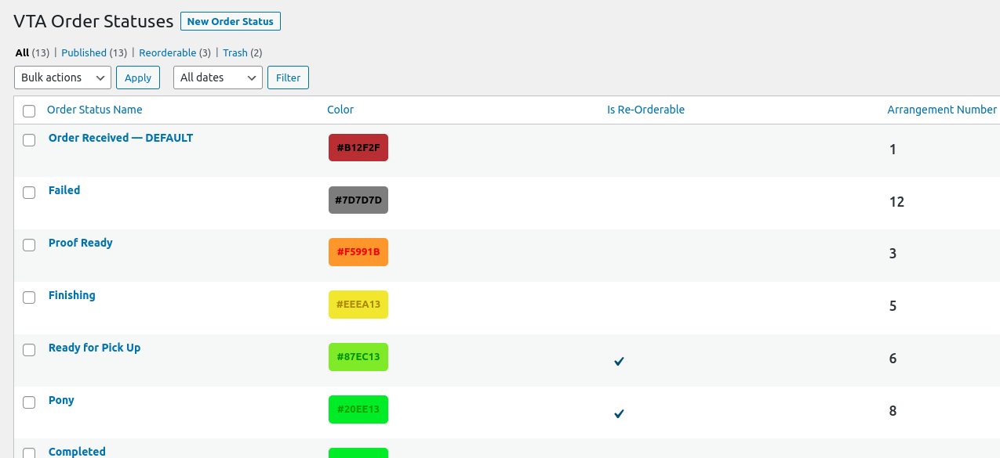

# VTA WooCommerce Custom Order Status Plugin

- **Contributors:** James Pham
- **Requirements:** 
  - PHP 7.4
  - WordPress 5.7
  - WooCommerce 4.6.1.
- **License:** GPLv2 or later
- **License URI:** http://www.gnu.org/licenses/gpl-2.0.html

A WooCommerce extension that integrates core WooCommerce features into custom VTA Document Services requirements. This
plugin provides admins the ability to customize WC order statuses and related WC components to fit their workflow.

---

## Description
This plugin uses the built-in WP Post API, WP Options/Settings API, and WooCommerce hooks to integrate custom order 
statuses. 

To avoid customizing ALL aspects of the plugin, the plugin utilizes CPT (Custom Post Types) to rely on data structure, 
data retention, and admin views. Any additional plugin settings is handled by custom WP Options provided by the plugin.

Lastly, any custom hooks that were formerly defined in the theme folder is now migrated here for modularity purposes.

## Installation
Since this plugin is not in the official **[WordPress Plugin Directory](https://wordpress.org/plugins/)**, all
first time usage installation will be based on existing settings field. The plugin itself must be cloned from this GitHub
repository.

If `vta_order_status_options` does not exist in the `wp_options` table when the plugin is activated, the plugin will automatically
create default Order Statuses from WooCommerce's default order statuses as well as set up the settings field based on 
the newly created fields. 

_Beware: Deleting the plugin from the WP CLI or admin dashboard will delete all related CPT & settings data._

---

## Usage

### Post Attributes
| **Post Type**      | **Postmeta "Color"** | **Postmeta "Reorderable"** |
|--------------------|----------------------|----------------------------|
| `vta_order_status` | `vta_cos_color`      | `vta_cos_is_reorderable`   |

### Options Attributes
| **Options Key**            | **"Default" Array Key** | **"Arrangement" Array Key** |
|----------------------------|-------------------------|-----------------------------|
| `vta_order_status_options` | `order_status_default`  | `order_status_arrangement`  |

_**NOTE**: "Default" & "Arrangement" keys are used on the resulting array from `get_options('vta_order_status_options')`._

---

## Custom Emails

A WooCommerce email is attached to the order status. All emails will use our custom email class `classes/VTACustomEmail.php` which uses our custom email templates defined in `templates/`. The settings can be found in **WooCommerce** -> **Settings** -> **Emails**.

### Reminder Emails

If an order status has been configured to have a reminder email, an additional, separate email template will be available for admins to configured. Reminder time and action button to "Complete" are configurable.

